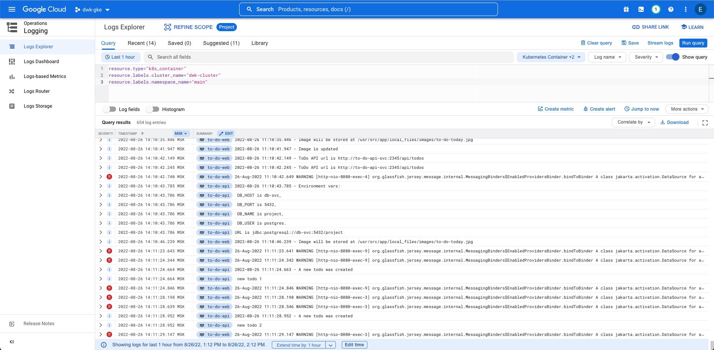

# Exercise 3.10: Project v1.6

## Exercise description

GKE includes monitoring systems already, so we can just enable the monitoring.

Read documentation for Kubernetes Engine Monitoring [here](https://cloud.google.com/monitoring/kubernetes-engine) and setup logging for the project in GKE.

You can optionally include Prometheus as well.

Submit a picture of the logs when a new todo is created.

## Exercise realization

1. First of all I checked that `Cloud Logging API` is enabled, by listing all the enabled services:
    ```shell
    gcloud services list --project=<Project ID>
    ```
2. Then I configured the cluster not to send monitoring logs:
    ```shell
    gcloud container clusters update dwk-cluster --zone=europe-north1-c --monitoring NONE
    ```
3. And enabled Prometheus feature:
    ```shell
    gcloud container clusters update dwk-cluster --zone=europe-north1-c --enable-managed-prometheus
    ```
4. Then I added couple of todos and checked cluster logs through the details page to see:
   
