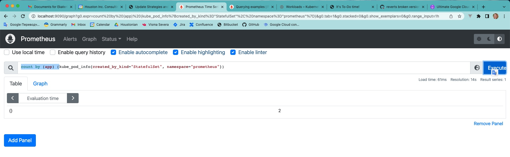

# Exercise 4.03: Prometheus

## Exercise description

We've been using Prometheus since part 2, but basically we've only heard the name and seen some nice graphs on Grafana. Let's do a single hands-on query to learn more.

Start a Prometheus with helm (see part 2) and use port-forward to access the gui website. Port 9090 is the default for Prometheus:

> $ kubectl -n prometheus get pods
>
>| NAME                                                            | READY | STATUS  | RESTARTS | AGE |
>|-----------------------------------------------------------------|-------|---------|----------|-----|
>| kube-prometheus-stack-1602-operator-557c9c4f5-wbsqc             | 2/2   | Running | 0        | 17h |
>| kube-prometheus-stack-1602180058-prometheus-node-exporter-tr7ns | 1/1   | Running | 0        | 17h |
>| kube-prometheus-stack-1602180058-grafana-59cd48d794-4459m       | 2/2   | Running | 0        | 17h |
>| prometheus-kube-prometheus-stack-1602-prometheus-0              | 3/3   | Running | 1        | 17h |
>| kube-prometheus-stack-1602180058-prometheus-node-exporter-ft7dg | 1/1   | Running | 0        | 17h |
>| kube-prometheus-stack-1602180058-prometheus-node-exporter-nt8cp | 1/1   | Running | 0        | 17h |
>| kube-prometheus-stack-1602180058-kube-state-metrics-55dccdkkz6w | 1/1   | Running | 0        | 17h |
>| alertmanager-kube-prometheus-stack-1602-alertmanager-0          | 2/2   | Running | 0        | 17h |

>$ kubectl -n prometheus port-forward prometheus-kube-prometheus-stack-1602-prometheus-0 9090:9090
>
>Forwarding from 127.0.0.1:9090 -> 9090
> 
>Forwarding from [::1]:9090 -> 9090

And now accessing http://localhost:9090 will allow us to write queries. 

Write a query that shows the number of pods created by StatefulSets in "prometheus" namespace. 

For the above setup the "Value" should be 2 different pods. Something similar:

| Element | Value |
|---------|-------|
| Scalar  | 	2    |

Query for "kube_pod_info" should have the required fields to filter through. 
See documentation for help with querying.

## Exercise realization

1. First of all I set up Prometheus to GCP with:
    ```shell
    kubectl create namespace prometheus
    helm install prometheus-community/kube-prometheus-stack --generate-name --namespace prometheus
    ```
2. After the installation was completed I found out prometheus pod name with:
    ```shell
    kubectl get po -n prometheus
    ```
3. And port forwarded it to localhost with:
    ```shell
    kubectl -n prometheus port-forward prometheus-kube-prometheus-stack-1601-prometheus-0 9090:9090
    ```
4. Then went to http://localhost:9090 and executed query `count by (app) (kube_pod_info{created_by_kind="StatefulSet", namespace="prometheus"})`:

   